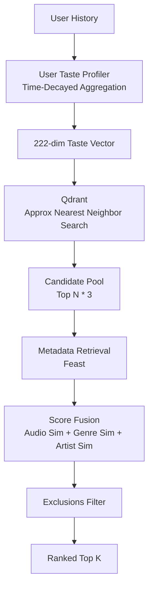

# Content-Based Filtering Model (Phase 8)

## Architecture Overview
The Content-Based Recommendation Model fuses strict dense vector retrieval (Qdrant) with structured metadata similarity (Feast/Redis).

## Modularity & Extensibility
The scoring equation strictly separates audio similarity from metadata similarity:
`FinalScore = (W_audio * CosineSim_audio) + (W_genre * JaccardSim_genre) + (W_artist * Sim_artist)`

If `Text/Lyrics embeddings` are introduced later, they will seamlessly plug into this equation via configurable weights in `SimilarityWeights`.

## Strict Temporal Evaluation
To prevent information leakage from future listening habits:
- The `UserTasteProfiler` strictly zeroes out interactions that happen `> ReferenceTime`.
- The `TemporalEvaluator` evaluates recommendations at `T_split` without having any knowledge of the test set interactions.

## Score Semantics
As specifically requested in Phase 8 architecture review:
**Cosine similarity and raw score fusions are preserved**. Per-request Min-Max normalization is disabled for Content-Based models to preserve absolute semantic distance. The Hybrid Engine will calibrate these unbounded absolute scores later in Phase 10.
