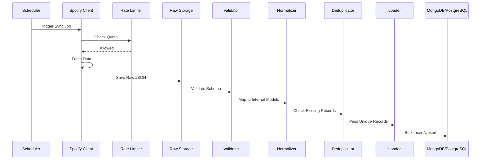

# ETL Ingestion Pipeline Architecture

This document defines the strict sequential flow of data from external sources (like Spotify) through our extraction, transformation, and loading (ETL) pipeline into our core databases.

## Sequence Diagram

