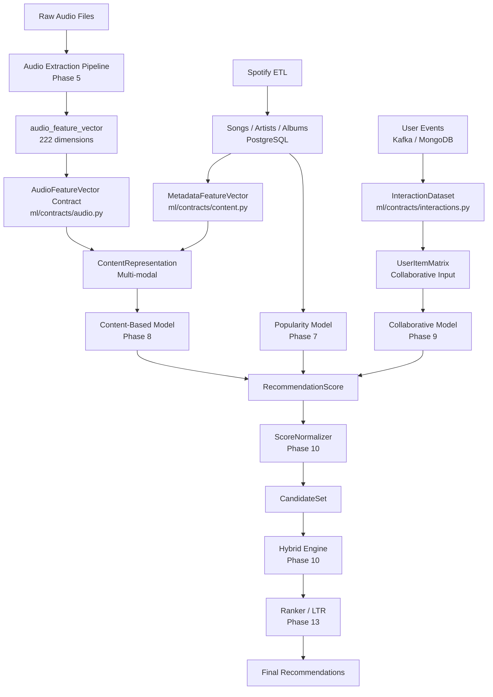

# ML Architecture Overview

## Data Flow

## Module Ownership

| Contract File | Consumed By |
|---|---|
| `contracts/audio.py` | Content-Based, Feature Store |
| `contracts/content.py` | Content-Based |
| `contracts/user.py` | Collaborative, Hybrid |
| `contracts/interactions.py` | Collaborative |
| `contracts/recommendations.py` | All models |
| `contracts/candidates.py` | Hybrid Engine |
| `contracts/models.py` | Training pipeline, serving |
| `contracts/evaluation.py` | Evaluation pipeline |
