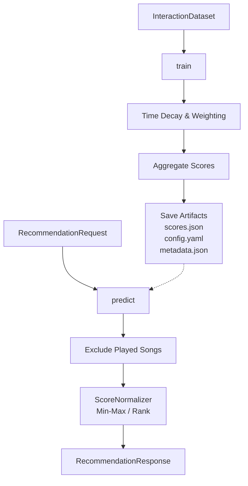

# Popularity Recommendation Model (Phase 7)

## Objective
The Popularity Model serves as the deterministic baseline for the music recommendation system. It evaluates the raw "engagement strength" of a track across the entire user base while discounting older interactions through exponential time decay. 

This model guarantees fallback availability during cold-start scenarios where a user has zero historical data.

## Architecture

## Configurable Signals
Interactions are weighted according to `InteractionWeightConfig`:
- `play`: 1.0
- `complete`: 2.0
- `like`: 4.0
- `skip`: -1.0
- `skip_early`: -2.0

## Recency Strategy (Time Decay)
The model applies an exponential decay function:
`Score = Weight * (0.5 ^ (DaysSinceInteraction / HalfLifeDays))`

Two modes are provided:
1. **Global Popularity**: `half_life_days = 180.0`. Favors historically popular tracks that remain consistent staples.
2. **Trending Popularity**: `half_life_days = 7.0`. Favors tracks that are currently viral, discarding old data rapidly.

## Normalization
Scores are inherently unbounded positive floats. To satisfy the requirements of the Hybrid Engine, they are pushed through a `ScoreNormalizerInterface`.
- **MinMaxNormalizer**: Maps raw scores linearly to `[0, 1]`.
- **RankNormalizer**: Maps rank positions to `[0, 1]`.

## Evaluation Methodology
Evaluated via `TemporalEvaluator` ensuring strict time cutoffs.
- **Train Data**: Interactions `[T0, T_split]`
- **Test Data**: Interactions `[T_split, T_end]`

Leakage is strictly prevented by passing `date_range_end` as the temporal horizon. Future interactions receive a `0.0` decay multiplier if accidentally included.

## Future Kafka Integration
The model includes an abstraction `PopularityStateUpdater` which contains a `record_interaction()` method. In the future, a Kafka consumer topic can pipe real-time streaming events into this abstraction to increment scores online without full dataset retrains.
