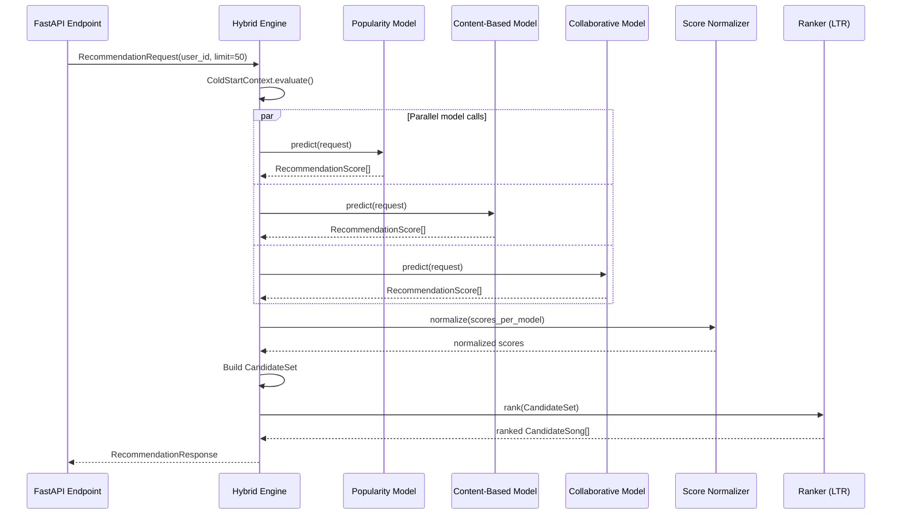

# Recommendation Data Flow

## Request → Response Flow

```mermaid
sequenceDiagram
    participant API as FastAPI Endpoint
    participant Hybrid as Hybrid Engine
    participant Pop as Popularity Model
    participant CB as Content-Based Model
    participant CF as Collaborative Model
    participant Norm as Score Normalizer
    participant Rank as Ranker (LTR)

    API->>Hybrid: RecommendationRequest(user_id, limit=50)
    Hybrid->>Hybrid: ColdStartContext.evaluate()

    par Parallel model calls
        Hybrid->>Pop: predict(request)
        Pop-->>Hybrid: RecommendationScore[]
    and
        Hybrid->>CB: predict(request)
        CB-->>Hybrid: RecommendationScore[]
    and
        Hybrid->>CF: predict(request)
        CF-->>Hybrid: RecommendationScore[]
    end

    Hybrid->>Norm: normalize(scores_per_model)
    Norm-->>Hybrid: normalized scores
    Hybrid->>Hybrid: Build CandidateSet
    Hybrid->>Rank: rank(CandidateSet)
    Rank-->>Hybrid: ranked CandidateSong[]
    Hybrid-->>API: RecommendationResponse
```
