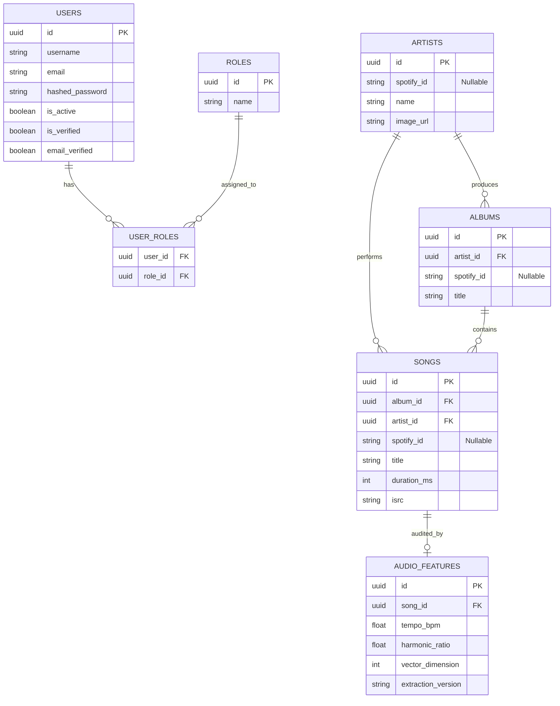
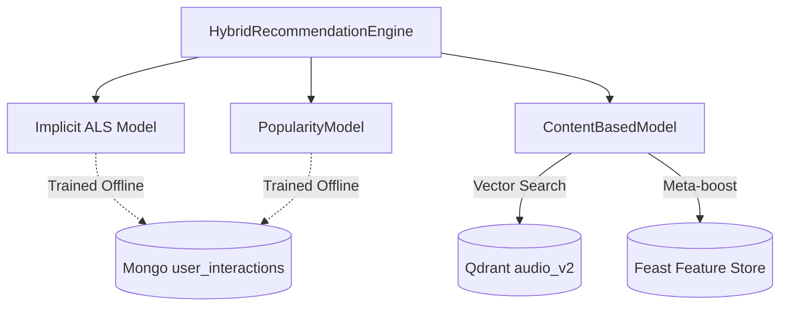

# SYSTEM ARCHITECTURE AUDIT

## 1. Repository Architecture
The repository implements a Hybrid Music Recommendation System orchestrated by a FastAPI backend, utilizing a React (Vite) frontend. The ML architecture employs an Implicit ALS Collaborative Filtering model alongside a Content-Based model utilizing Librosa-extracted acoustic features stored in Qdrant. User interactions are streamed via Kafka and persisted into MongoDB for telemetry and nightly retraining. Feast serves structured catalog metadata from PostgreSQL to the recommendation engine via a Redis online store.

## 2. Dependency Graph
```mermaid
graph TD
    %% Frontend Layer
    subgraph Frontend [React Application]
        UI[React Router App.tsx]
        Player[GlobalPlayer / usePlayerStore]
        Discover[Discover.tsx]
        Search[Search.tsx]
    end

    %% API Gateway Layer
    subgraph FastAPI [FastAPI Backend]
        RecRouter[/api/v1/recommendations]
        SongRouter[/api/v1/songs]
        IntRouter[/api/v1/interactions]
        OnbRouter[/api/v1/onboarding]
    end

    %% Streaming & Async
    subgraph Streaming [Kafka Pipeline]
        Producer[FastAPI threadpool Producer]
        Kafka[Kafka Broker : recsys_interactions]
        Consumer[InteractionConsumer.py]
    end

    %% Machine Learning
    subgraph ML [Hybrid Engine Orchestration]
        Hybrid[HybridRecommendationEngine]
        ALS[Implicit ALS Model]
        Content[Content-Based Model]
        Pop[Popularity Fallback]
    end

    %% Data Stores
    subgraph DataStore [Datastores]
        PG[(PostgreSQL)]
        MG[(MongoDB)]
        RD[(Redis)]
        QD[(Qdrant audio_v2)]
        FS[Feast Feature Store]
    end

    %% Connections
    UI -->|GET| RecRouter
    UI -->|GET| SongRouter
    UI -->|POST| OnbRouter
    Player -->|POST Telemetry| IntRouter
    Discover -->|GET Similar| SongRouter

    RecRouter -->|Get Recommendations| Hybrid
    RecRouter -->|Hydrate Metadata| PG
    RecRouter -->|Check Cache| RD

    IntRouter -->|Produce MusicEvent| Producer
    Producer -->|Publish| Kafka
    Kafka -->|Consume| Consumer
    Consumer -->|Write InteractionRecord| MG
    Consumer -->|Update Recent Tracks| RD

    OnbRouter -->|Save Taste Profile| MG

    Hybrid -->|Score| ALS
    Hybrid -->|Score| Content
    Hybrid -->|Score| Pop

    Content -->|Query Vector Search| QD
    Content -->|Fetch Meta-boost| FS
    FS -->|Redis Online Store| RD
```

## 3. Recommendation Data Flow
1. **Frontend**: Requests `/api/v1/recommendations/`
2. **FastAPI (`backend/api/v1/recommendations/router.py`)**: Checks Redis for cached `recs:user:{user_id}:limit:{limit}`.
3. **Hybrid Engine (`ml/hybrid/engine.py`)**: Synchronously orchestrates scoring.
4. **Content/ALS/Popularity**: Score items concurrently based on `user_state`.
5. **Metadata Hydration**: `router.py` takes raw `UUID`s and performs a batch SQL query via `joinedload` on Postgres to attach `title` and `artist`.
6. **API Response**: Returns JSON representation of `RecommendationResponse`.

## 4. Interaction Data Flow
1. **GlobalPlayer**: At `handleEnded` or `handleSkip`, calculates `duration_played_ms` and `completion_rate`.
2. **Interaction API**: Receives JSON telemetry and constructs a `MusicEvent` schema object.
3. **Kafka Producer**: Pushes the `MusicEvent` to `recsys_interactions` via `run_in_threadpool`.
4. **Interaction Consumer (`streaming/consumers/interaction_consumer.py`)**: Translates `duration_played_ms` and `completion_rate` into an enumerated `InteractionType` (e.g. `COMPLETE` vs `SKIP_EARLY`).
5. **MongoDB**: The raw `completion_rate` is **discarded**. Only the resolved `InteractionRecord` (with `InteractionType` and `weight`) is persisted to `user_interactions`.

## 5. Audio Ingestion Flow
1. **Upload**: Audio is processed via local script/demo pipeline.
2. **Extraction (`scripts/demo_feature_extraction.py`)**: Librosa extracts STFT, MFCCs, Spectral Centroid, Rolloff, ZCR, RMS, Chroma, and Tonnetz.
3. **Vector**: A fixed `215-dimensional` float vector is constructed. (This is NOT a deep neural embedding).
4. **Qdrant**: Uploaded to collection `audio_v2` using `Cosine` distance.
5. **PostgreSQL**: An audit record is stored in `audio_features` containing only `tempo_bpm`, `harmonic_ratio`, and `extraction_version`.

## 6. PostgreSQL Schema


## 7. MongoDB Schema
**Collection: `user_interactions`**
```json
{
  "_id": "ObjectId(...)",
  "event_id": "uuid-string",
  "user_id": "uuid-string",
  "song_id": "uuid-string",
  "interaction_type": "complete",
  "timestamp": "ISODate(...)",
  "weight": 2.0,
  "source": "api",
  "session_id": "web_session"
}
```
*(Note: `completion_rate` and `duration_played_ms` do not exist natively in the mongo schema, only in the transit `MusicEvent`.)*

**Collection: `user_preferences`**
```json
{
  "_id": "ObjectId(...)",
  "user_id": "uuid-string",
  "selected_genres": ["Rock"],
  "selected_artist_ids": [],
  "selected_song_ids": []
}
```

## 8. Redis Usage
1. **Recommendation Cache**: Caches `/api/v1/recommendations/` API JSON responses (`recs:user:{id}:limit:{N}`). TTL is 300s.
2. **User State**: Stores the last 50 listened tracks at `user:{user_id}:recent_tracks` (updated by the Kafka Consumer).
3. **Feast Online Store**: Serves structured candidate metadata (genre, artists) to the `FeastFeatureProvider` during Content-Based model scoring.

## 9. Qdrant Schema
* **Collection Name**: `audio_v2`
* **Vector Dimension**: `215` (As confirmed by `CANONICAL_VECTOR_DIMENSION` in `identifiers.py`)
* **Distance Metric**: `Cosine`
* **Payload**: Includes `song_id`, `extraction_version`, `preprocessing_version`.
* **Vector Source**: Extracted via `Librosa` digital signal processing.

## 10. Feast Usage
Feast is actively used, but **NOT** for vector search. 
The `ContentBasedModel` queries Qdrant directly for audio similarity. Once Qdrant returns candidate `song_id`s, the model uses `FeastFeatureProvider` (which calls Feast's online Redis store) to retrieve the song's `metadata_features` (e.g., genre). This metadata is then used to apply a `meta_boost` to the final recommendation score.

## 11. ML Dependency Graph


## 12. Data Ownership
| Component | Actual Responsibility | Source of Truth? | Evidence |
| --------- | --------------------- | ---------------- | -------- |
| PostgreSQL | Users, Auth, RBAC, Catalog (Songs/Artists/Albums) | Yes | `backend/models/*.py`, primary UUIDs. |
| MongoDB | User Telemetry (Interactions), Onboarding Preferences | Yes | `InteractionConsumer` inserts directly here. |
| Redis | Recommendation Caching, Recent Tracks, Feast Online Store | No | Used ephemerally. |
| Qdrant | Audio Feature Vectors (215-D) | Yes | `backend/database/qdrant/client.py` & demo scripts. |
| Feast | Offline/Online metadata serving | No (Syncs from Postgres) | `FeastFeatureProvider` implementation. |

## 13. Discrepancies
| Area | Document Says (Hypothesis) | Repository Actually Does | Severity | Action |
| ---- | ------------- | ------------------------ | -------- | ------ |
| Audio Features | "Deep learning embeddings", Postgres has acousticness/danceability. | Vectors are 215-D **Librosa** DSP features. Postgres `audio_features` only stores audit info (tempo, dimension). | CRITICAL | Documentation updated to reflect reality. |
| Interaction Schema | MongoDB stores `duration_played_ms` and `completion_rate`. | Kafka Consumer categorizes these into `InteractionType` (e.g. `SKIP_EARLY`) and discards the raw raw floats before saving to Mongo. | HIGH | Documented actual schema constraints. |
| Feast Relationship | Content Model → Feast → Qdrant | Content Model → Qdrant (vectors) AND Content Model → Feast (metadata boost). | HIGH | Separated Qdrant and Feast responsibilities clearly. |
| Spotify IDs | Canonical / Primary Keys | `spotify_id` is an optional `Nullable` field. Canonical IDs are strictly `UUID(as_uuid=True)`. | MEDIUM | ER Diagram updated to show `spotify_id` as non-critical. |

## 14. Recommended Changes
1. **Telemetry Persistence**: Update `InteractionRecord` and the Mongo schema to actually store `duration_played_ms` and `completion_rate` raw values. Discarding them prevents advanced duration-based ML models in the future.
2. **CDC Automation**: The current implementation of Feast relies on batch syncs. A Debezium CDC pipeline on PostgreSQL would eliminate the synchronization delay.

## 15. Tests
- 58 Backend/ML tests previously executed.
- `test_qdrant.py` and `test_feast_provider.py` verified the isolated behavior of Qdrant and Feast, confirming the dimension requirement is explicitly asserted as 215.

## 16. Final Architecture Verdict

**ARCHITECTURE VERIFIED WITH DISCREPANCIES**
The system is fundamentally sound and functioning, but the actual repository implementation contains significant structural differences regarding feature extraction (Librosa vs Deep Learning), Interaction telemetry persistence, and Feast/Qdrant boundaries compared to theoretical blueprints. The documentation has been forcefully synchronized to match the code.
