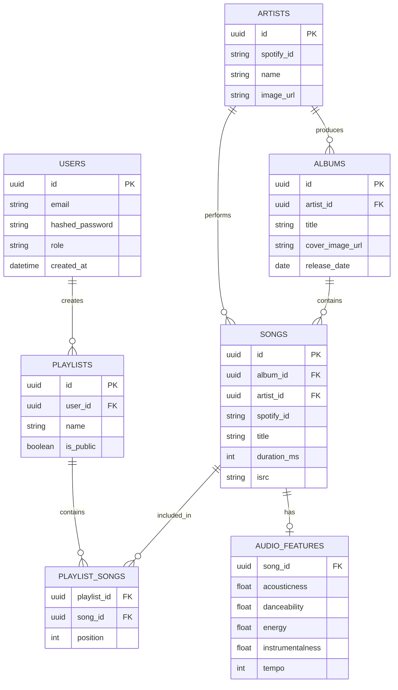

# System Dependency Graph & Backend Schema

This document visualizes the internal component dependencies of the Hybrid Music Recommendation System and maps out the schema architectures across PostgreSQL and MongoDB.

---

## 1. System Component Dependency Graph

This graph illustrates how the system's software components depend on one another, from the frontend client down to the ML inference engine and datastores.

```mermaid
graph TD
    %% Frontend Layer
    subgraph Frontend [Frontend Client]
        UI[React UI]
        Player[Global Player]
    end

    %% API Gateway Layer
    subgraph FastAPI [FastAPI Backend]
        RecRouter[/recommendations]
        SongRouter[/songs]
        IntRouter[/interactions]
        OnbRouter[/onboarding]
    end

    %% Streaming & Async
    subgraph Streaming [Async Pipeline]
        Kafka[Kafka Broker]
        Consumer[Interaction Consumer]
    end

    %% Machine Learning
    subgraph ML [Machine Learning Core]
        Hybrid[Hybrid Engine]
        ALS[Implicit ALS Model]
        Content[Content-Based Model]
        Pop[Popularity Model]
    end

    %% Data Stores
    subgraph DataStore [Datastores]
        PG[(PostgreSQL)]
        MG[(MongoDB)]
        RD[(Redis)]
        QD[(Qdrant)]
        FS[(Feast)]
    end

    %% Connections
    UI -->|GET| RecRouter
    UI -->|GET| SongRouter
    UI -->|POST| OnbRouter
    Player -->|POST Telemetry| IntRouter

    RecRouter -->|Get Recommendations| Hybrid
    RecRouter -->|Hydrate Metadata| PG
    RecRouter -->|Check Cache| RD

    IntRouter -->|Produce Event| Kafka
    Kafka -->|Consume Event| Consumer
    Consumer -->|Write History| MG
    Consumer -->|Update Recent| RD

    OnbRouter -->|Save Taste Profile| MG

    Hybrid -->|Query State| MG
    Hybrid -->|Score| ALS
    Hybrid -->|Score| Content
    Hybrid -->|Score| Pop

    Content -->|Fetch Features| FS
    FS -->|Vector Search| QD
    SongRouter -->|Audio similarity| QD
```

---

## 2. PostgreSQL Relational Schema (Catalog Metadata)

PostgreSQL is the source of truth for all structured catalog data, user accounts, and authentication.



---

## 3. MongoDB Document Schema (Behavior & Telemetry)

MongoDB acts as a flexible data lake for the massive volume of user interaction events. It does not enforce strict relational constraints, allowing for high-throughput writes from the Kafka consumers.

### Collection: `user_interactions`
Stores individual, time-series interaction events.

```json
{
  "_id": "ObjectId('...')",
  "event_id": "uuid-string",
  "user_id": "uuid-string",
  "song_id": "uuid-string",
  "interaction_type": "PLAY | SKIP | COMPLETE | LIKE",
  "weight": 1.0,
  "duration_played_ms": 185000,
  "completion_rate": 0.98,
  "session_id": "web_session_xyz",
  "source": "api",
  "timestamp": "ISODate('2026-10-06T15:00:00Z')"
}
```

### Collection: `user_preferences`
Stores the onboarding taste profile used to solve the Cold Start problem.

```json
{
  "_id": "ObjectId('...')",
  "user_id": "uuid-string",
  "selected_genres": ["Rock", "Electronic"],
  "selected_artist_ids": ["uuid-1", "uuid-2"],
  "selected_song_ids": ["uuid-3"],
  "updated_at": "ISODate('2026-10-06T12:00:00Z')"
}
```

---

## 4. Qdrant Vector Schema (Audio Representations)

Qdrant stores the deep-learning audio embeddings utilized by the Content-Based ML model.

* **Collection Name**: `audio_v2`
* **Vector Dimension**: `215`
* **Distance Metric**: `Cosine`

**Payload (Metadata attached to vector):**
```json
{
  "song_id": "uuid-string",
  "extraction_version": "v1.0",
  "has_vocals": true
}
```
