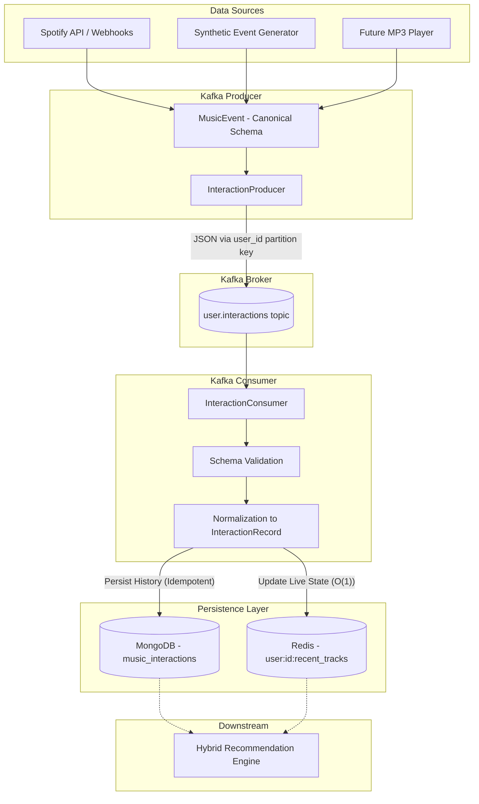

# Music Recommendation Event Flow

The system uses a decoupled, event-driven architecture powered by Kafka to capture and persist user interactions. This guarantees high throughput, asynchronous processing, and separation of concerns between data collection and data persistence.

## Flow Diagram

## Contract Details

### Canonical Event: `MusicEvent`
Every source must map its interactions to the canonical `MusicEvent` schema before publishing. This shields the internal Kafka infrastructure from third-party (e.g. Spotify) specific response payloads.

Fields:
- `event_id`: Unique idempotency key.
- `user_id`: Partition key for Kafka ordering.
- `track_id`: Canonical track ID.
- `event_type`: PLAY, LIKE, SKIP.
- `source`: E.g. 'spotify', 'synthetic'.
- `timestamp`: UTC.

### Consumer Behavior
1. **Idempotency**: The consumer uses a unique index on `event_id` in MongoDB. If a duplicate event arrives (e.g., due to Kafka at-least-once redelivery), MongoDB raises a `DuplicateKeyError`, which the consumer safely catches and ignores.
2. **State Updates**: It maintains a capped list (e.g., last 50 tracks) in Redis under `user:{user_id}:recent_tracks` for low-latency retrieval by the Hybrid Recommender.
