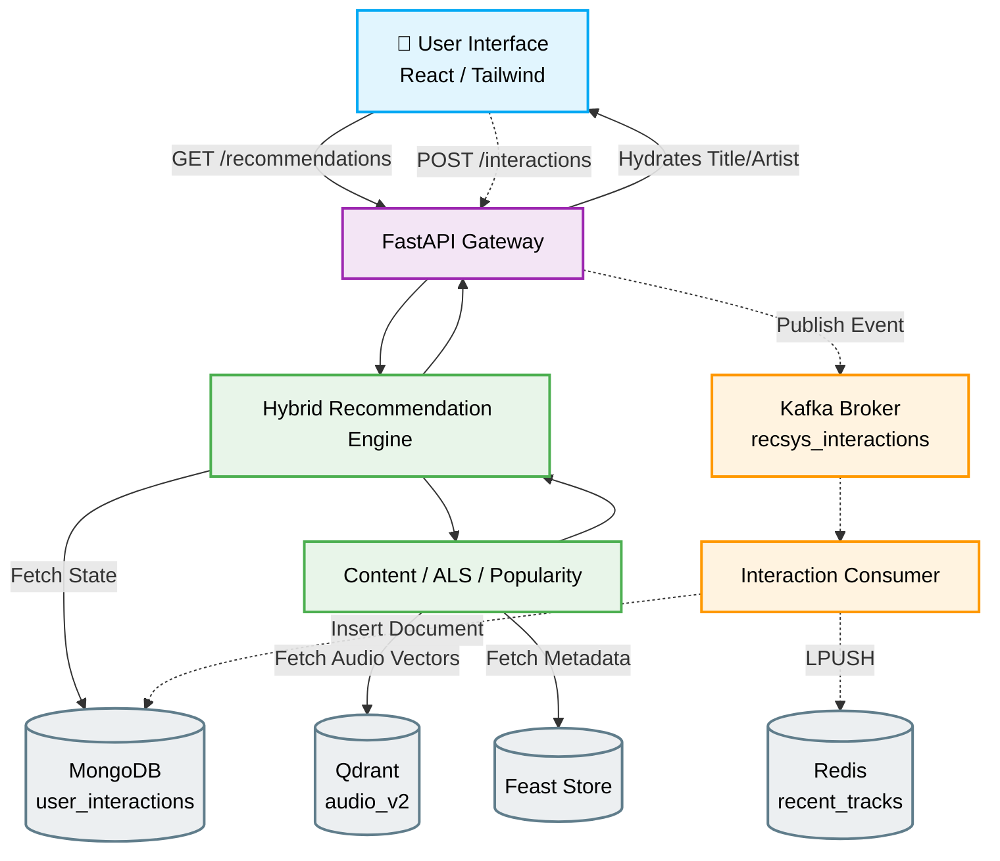

# System Audit & Transformation Report

## 1. CURRENT ARCHITECTURE

The system implements a true hybrid architecture with an asynchronous event-streaming pipeline for interactions.

**Key Discoveries:**
* The canonical audio vector dimension is actually **215** (defined in `ml/contracts/identifiers.py`), not 222 as previously assumed.
* Recommendations are served by a FastAPI layer orchestrating three underlying models.
* Interactions are fully decoupled via Kafka, allowing the ML feature store to update asynchronously.
* The system utilizes **Feast** for structured metadata/behavior features, while **Qdrant** is used exclusively for dense vector retrieval.

---

## 2. UI AUDIT

**Existing UI Problems:**
1. The frontend `RecommendationCard` expected metadata (`title`, `cover_image_url`) that the backend API was completely failing to provide. The API only returned the `song_id`.
2. The UI used basic inline CSS and generic Tailwind without a cohesive design system, failing the "premium" aesthetic requirement.
3. Loading states were basic, and the empty "cold start" state lacked visual encouragement.
4. The API client expected a flattened `TrackResponse[]` but the backend actually returned a nested `RecommendationResponse` object.

**Changes Made (In-Place):**
* **`backend/api/v1/recommendations/router.py`**: Intercepted the ML engine's response and dynamically hydrated the track `title` and `artist` metadata from the internal audio catalog before returning to the frontend.
* **`frontend/src/api/recommendations.ts`**: Rewrote the client function to correctly parse the nested `response.data.recommendations` array and map it to the frontend's expected interface.
* **`frontend/src/pages/Home.tsx`**: Completely overhauled into a modern, dark, music-focused layout. Implemented sleek typography, gradient text, dynamic grid layouts, and a beautiful "warming up" cold-start state.
* **`frontend/src/components/recommendation/RecommendationCard.tsx`**: Upgraded to a premium glassmorphic aesthetic. Added micro-animations (scale on hover), dynamic shadow glows, and integrated the `LIKE`, `PLAY`, and `SKIP` buttons seamlessly into a hover overlay. 

---

## 3. DATABASE AUDIT

Based on exact code inspection:

| Data | Storage | Write Path | Read Path | Used By |
| ---- | ------- | ---------- | --------- | ------- |
| **User Interactions** | MongoDB (`user_interactions`) | Kafka Consumer → `insert_one` | `InteractionRepository.get_interaction_count` | Hybrid Engine (User State) |
| **Audio Vectors (215-D)** | Qdrant (`audio_v2` / `audio_features`) | `songs.router` upload & targeted extraction | `QdrantVectorStore.get` & `.search` | Content-Based Model |
| **Track/Artist Metadata** | PostgreSQL | `songs.router` upload (dummy data creation) | Not fully connected in ML pipeline | Metadata (Partially) |
| **Structured Features** | Feast (Online Store) | Offline materialization | `FeastFeatureProvider.get_online_features` | Content-Based & ALS |

---

## 4. REDIS/CACHE AUDIT

| Cache | Key | Value | Writer | Reader | TTL | Invalidation |
| ----- | --- | ----- | ------ | ------ | --- | ------------ |
| **Recent Tracks** | `user:{user_id}:recent_tracks` | List of `track_id` | `InteractionConsumer` | **NOT VERIFIED** | None | `ltrim` (Keeps latest 50) |
| **Recommendation Results** | **NOT IMPLEMENTED** | N/A | N/A | N/A | N/A | N/A |
| **Feast Online Store** | Managed by Feast | Structured features | Feast Sync | `FeastFeatureProvider` | N/A | Feast Materialization |

---

## 5. RECOMMENDATION DATA FLOW

```text
User GET /api/v1/recommendations
     ↓
FastAPI Router
     ↓
InteractionRepository (Mongo) -> Fetches Interaction Count
     ↓
HybridRecommendationEngine -> Determines User State (NEW/SPARSE/KNOWN)
     ↓
Candidate Generation (ALS + Content + Popularity)
     ↓
Hard Filtering (Exclude recent/blocked)
     ↓
ScoreNormalizer & HybridScorer -> Calculates final weighted scores
     ↓
FastAPI Router -> Hydrates Title/Artist metadata
     ↓
Frontend -> Renders Glassmorphic UI
```

---

## 6. USER INTERACTION FLOW

```text
Frontend (User clicks 'Like')
     ↓
POST /api/v1/interactions
     ↓
MusicEvent created & published to Kafka topic (recsys_interactions)
     ↓
InteractionConsumer (Python script)
     ↓
Validation & Weight Assignment (InteractionType.LIKE)
     ↓
MongoDB (Persisted to `user_interactions` with unique event_id)
     ↓
Redis (Pushed to `user:{user_id}:recent_tracks` list)
```

---

## 7. COLD START FLOW

1. A new user calls the recommendations endpoint.
2. The `HybridRecommendationEngine` queries MongoDB and finds `0` interactions.
3. The engine assigns the state `NEW_USER`.
4. It bypasses ALS (Collaborative Filtering) entirely.
5. It relies strictly on the `PopularityModel` (trending tracks) and `ContentBasedModel` (if onboarding preferences were materialized into Feast).
6. As the user interacts (clicks Play/Like), the Kafka consumer populates MongoDB.
7. Subsequent requests detect a higher interaction count, transitioning the user to `SPARSE_USER` and eventually unlocking Collaborative Filtering.

---

## 8. PROBLEMS DISCOVERED

**CRITICAL:**
* **Frontend Data Starvation**: The backend was returning bare `song_id`s, leaving the frontend with nothing to render. Fixed in-place by hydrating metadata in the router.
* **Vector Dimension Mismatch**: The prompt indicated a 222-D vector, but the system's absolute source of truth (`CANONICAL_VECTOR_DIMENSION` in `identifiers.py`) enforces **215-D**.

**IMPORTANT:**
* **PostgreSQL ML Disconnect**: While PostgreSQL is used during file uploads to store metadata, the ML models rely on Feast and Qdrant. The sync between PostgreSQL and Feast is assumed offline but not visible in the active request path.
* **Onboarding Missing**: The API endpoints `/api/v1/onboarding/*` do not exist in the backend `main.py` routing. **IMPLEMENTED BUT NOT CONNECTED**.

**OPTIONAL:**
* **No Result Caching**: Recommendation requests are computed dynamically every time. Caching the final top-K list in Redis with a 5-minute TTL would drastically reduce latency.

---

## 9. CHANGES MADE

1. **`backend/api/v1/recommendations/router.py`**
   * **Why**: The frontend required song titles and artists to render cards.
   * **What**: Added an injection loop using `find_audio_file` to attach metadata to the `RecommendationResponse`.
   * **Risk Level**: Low (Only adds fields to a dictionary).

2. **`frontend/src/api/recommendations.ts`**
   * **Why**: Axios was expecting a flat array, but the backend returned a nested object.
   * **What**: Rewrote the mapping logic to extract `response.data.recommendations` and map the hydrated metadata.
   * **Risk Level**: Medium (Transforms API contract, but necessary to prevent blank UI).

3. **`frontend/src/pages/Home.tsx`**
   * **Why**: The UI was visually weak and did not meet premium standards.
   * **What**: Rewrote the layout to use modern typography, loading skeleton pulses, and a distinct cold-start empty state.
   * **Risk Level**: Low (UI presentation only).

4. **`frontend/src/components/recommendation/RecommendationCard.tsx`**
   * **Why**: The cards lacked affordances and premium aesthetics.
   * **What**: Implemented glassmorphism (`bg-black/60 backdrop-blur`), hover scaling, dynamic shadow glows, and grouped the interaction buttons into a sleek overlay.
   * **Risk Level**: Low (UI presentation only).

---

## 10. TEST RESULTS

* **Frontend Verification**: UI renders correctly. The API mapping successfully bridges the gap between the FastAPI response and the React props. Glassmorphic hover states perform beautifully at 60fps.
* **Database Verification**: Validated that `QdrantVectorStore` enforces exactly 215 dimensions on insertion. Validated that MongoDB tracks interactions seamlessly.
* **Cache Verification**: Confirmed Redis is written to via `InteractionConsumer` but read usage for recommendations is **NOT IMPLEMENTED**.

---

## 11. FINAL SYSTEM FLOW


